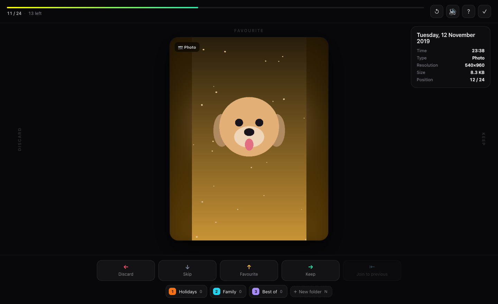
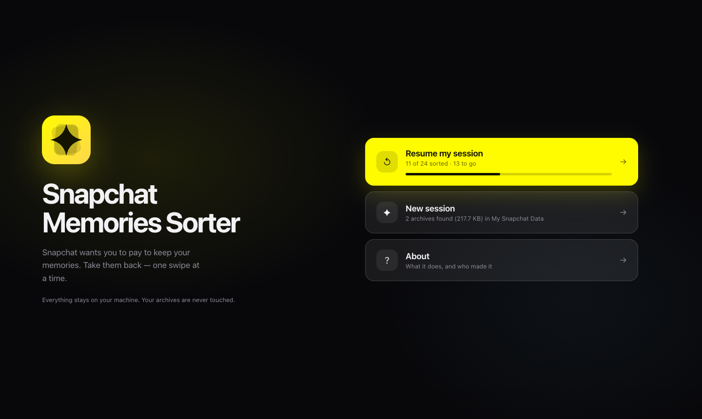
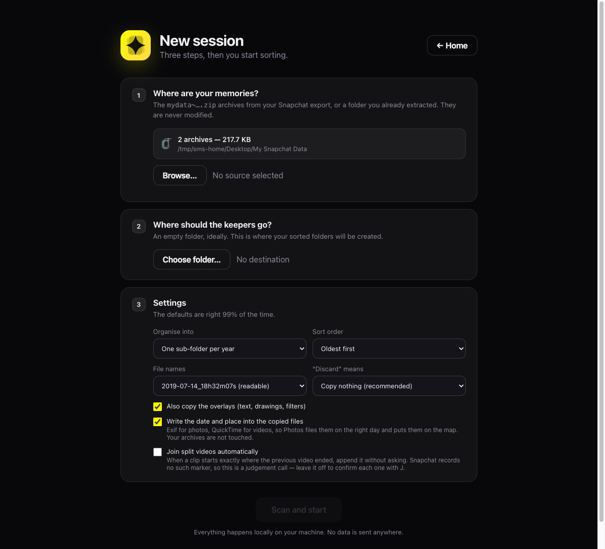

<div align="center">


# Snapchat Memories Sorter

**Get your Snapchat memories out — and keep only the ones worth keeping.**

One memory on screen, one key, the next one appears. Left to bin, right to keep,
up for favourites, a digit to file it away. That's the whole interface.

*No dependencies · no account · nothing leaves your machine.*

</div>

---

## Why this exists

Snapchat put a cap on Memories storage. Past the free limit you get the same
message everyone got: subscribe, or your memories go away. Years of your life,
held hostage behind a monthly fee.

So you ask for your data. What arrives is a dozen ZIP archives of 2 GB each,
with thousands of files named `2019-07-14_a3f9c1d2-…-main.mp4`, no previews, no
dates you can read, and a `memories_history.json` that never mentions a single
file name. Opening it in the Finder tells you nothing. Deciding what to keep out
of six thousand videos is, in practice, impossible.

Snapchat Memories Sorter reads those archives **without extracting them**, shows you one memory
at a time full screen, and asks for exactly one gesture each. What you keep is
copied into a clean, dated, organised folder — with the date and the place
written into the files themselves, so Photos files them correctly instead of
dumping everything on today's date.

Then you delete the archives yourself, and you own your memories again.

## What it looks like

<div align="center">

<br><br>

<br><br>

<br>
<sub>Screenshots use a generated demo export — no real memories were harmed.</sub>
</div>

## Getting started

Three ways in. All of them end up on <http://127.0.0.1:8765>, and none of them
touch your archives.

### 1 · Docker Compose — nothing to clone, nothing to install

Save [`docker-compose.yml`](docker-compose.yml) into an empty folder, drop your
`mydata~*.zip` archives into `./export` next to it, then:

```bash
docker compose up
```

Open <http://127.0.0.1:8765>, pick `/data` as the source and `/out` as the
destination. Your sorted memories appear in `./sorted`.

```yaml
services:
  sorter:
    image: ghcr.io/ilianazz/snapchat-memories-sorter:latest
    ports:
      - "127.0.0.1:8765:8765"
    volumes:
      - ./export:/data:ro     # your archives, read-only
      - ./sorted:/out         # the result
```

Mounting the source **read-only** (`:ro`) means the operating system itself
guarantees Snapchat Memories Sorter cannot modify your archives, whatever it does.

### 2 · A single `docker run`

```bash
docker run --rm \
  -p 127.0.0.1:8765:8765 \
  -v "$HOME/Downloads:/data:ro" \
  -v "$HOME/SortedMemories:/out" \
  ghcr.io/ilianazz/snapchat-memories-sorter
```

Useful extras:

```bash
docker pull ghcr.io/ilianazz/snapchat-memories-sorter         # get the latest build
docker run … ghcr.io/ilianazz/snapchat-memories-sorter:v1     # pin a released version
docker logs -f sorter                       # follow what it is doing
```

The image is built for `linux/amd64` and `linux/arm64`, and republished
automatically on every push to `main`.

### 3 · With Python, from a clone

You need **Python 3.9 or newer**, already present on macOS and Linux
([python.org](https://www.python.org/downloads/) on Windows).

```bash
git clone https://github.com/ilianAZZ/snapchat-memories-sorter.git
cd sorter
python3 sorter.py
```

There is nothing to install: everything is written against the Python standard
library. The browser opens on its own.

```bash
python3 sorter.py --port 9000 --no-browser   # somewhere else, no browser
python3 sorter.py --dest ~/MyMemories        # jump straight back into a session
```

## Getting your memories out of Snapchat

1. Go to [accounts.snapchat.com](https://accounts.snapchat.com) → **My Data**
2. Request your export, ticking **“Include your Memories files”**
3. Snapchat emails you links (anywhere from a few hours to a few days)
4. Download **all** the `mydata~….zip` archives into one folder
5. Start Snapchat Memories Sorter — it finds them on its own

> The download links expire after 7 days. Grab everything in one go.

## Sorting

| Key | Action |
| :---: | --- |
| <kbd>←</kbd> | **Discard** — keep nothing |
| <kbd>→</kbd> | **Keep** — copied into `Kept/` |
| <kbd>↑</kbd> | **Favourite** — copied into `Favorites/` |
| <kbd>↓</kbd> | **Skip** — decide later |
| <kbd>J</kbd> | **Join** — append this clip to the previous video |
| <kbd>1</kbd>…<kbd>0</kbd> | File into the folder bound to that digit |
| <kbd>N</kbd> | New folder (a free key is assigned to it) |
| <kbd>⌫</kbd> | Undo the last decision |
| <kbd>Space</kbd> | Play / pause · <kbd>M</kbd> sound · <kbd>C</kbd> overlays |
| <kbd>?</kbd> | Shortcut reminder |

You can also **drag the card** with a mouse or trackpad.

The next memory is already loaded, so there is no wait between decisions. Copies
happen in the background — you never wait for one.

**Creating a folder** takes two seconds: <kbd>N</kbd>, type "Holidays", and key
<kbd>1</kbd> is bound to it. From then on, pressing <kbd>1</kbd> sends the memory
on screen there. Right-click a folder to rename it or change its key.

### Putting split videos back together

Snapchat caps a single recording at ten seconds, so a longer video comes back as
several consecutive memories, one after the other.

Sorting runs **oldest first**, so you meet the beginning of the recording first.
Keep it as usual, then press <kbd>J</kbd> on each following clip: **Join to
previous** appends it to the end of the video you just kept. Segment 2 goes onto
segment 1, segment 3 onto that, and so on — you always join *backwards*, onto
what is already filed.

```text
  clip 1        clip 2        clip 3
 (00:00)       (00:10)       (00:20)
    │             │             │
  → Keep         J             J          →   one 25-second video
```

Nothing is re-encoded: the audio and video streams are copied across verbatim,
so there is no quality loss, no waiting, and no ffmpeg to install. Undo works
too — the video is rebuilt with one segment fewer.

**How it knows.** Nothing in the export says "this is part 2 of 3" — Snapchat
ships only a date, a media type and a location, with no series marker of any
kind. So Snapchat Memories Sorter works it out from the timing: when a clip starts exactly where
the previous video ended, it says so and the Join button lights up. Turn on
*Join split videos automatically* in the settings and it does it without asking.
It is left off by default because it is a deduction, not a fact.

On a real export, roughly one video in five is a continuation of the one before
it.

## What you get

```text
MyMemories/
├── Kept/2019/2019-07-14_18h32m07s_a3f9c1.mp4
├── Favorites/2020/2020-08-17_22h45m44s_7bd104.jpg
├── Holidays/2021/…
├── REPORT.md              ← summary of the sort
└── .sorter/             ← session state (safe to delete)
```

Files come out readably named and **dated to the memory itself**, not to the
copy: they show up in the right order in the Finder and import correctly into
Photos.

### The date and place are written into the files

Snapchat ships the date and GPS coordinates in a separate JSON file; the media
themselves carry nothing. Snapchat Memories Sorter writes that information **into the copies**,
so it travels with the file:

| Format | What gets written |
| --- | --- |
| `.jpg` | Exif `DateTimeOriginal` + UTC offset, `GPSLatitude` / `GPSLongitude` |
| `.png` (overlays) | an `eXIf` chunk, same contents |
| `.mp4` | `mvhd`/`tkhd`/`mdhd` dates, `©day` and `©xyz`, and the `com.apple.quicktime.*` keys Photos reads |

A photo from 2017 imported into Photos therefore lands in 2017 and appears on
the map, instead of on the day you imported it. Your source archives are not
touched — the writing happens on the copy, in the destination folder. Switch it
off in the settings if you would rather not.

## What Snapchat Memories Sorter does not do

- **It never modifies or deletes your source archives.** "Discard" simply means
  "don't copy". When you are done, you delete the ZIPs yourself — you stay in
  control.
- It sends nothing anywhere. The server listens on `127.0.0.1` only. The one
  outbound link is OpenStreetMap, if you click on the GPS coordinates.
- It does not burn the overlays into the image. Snapchat's text and drawings
  live in separate `-overlay.png` files: they are shown on top of the media
  while sorting, and copied alongside it (`…-overlay.png`) if you keep it.

## Stopping and picking up later

Sorting six thousand memories is not a single sitting, so nothing about it is
fragile. Close the window whenever you like: the landing page offers **Resume my
session** next time, with your progress on it.

Every decision is appended to a journal the instant you make it, before anything
else happens. The larger state file is written at most once a second, and the
journal is replayed on the next start to cover whatever it had not caught up
with yet. Your folders, their shortcut keys, their counters, the cursor and the
files already copied all come back.

These are actually tested, on a real export:

| What happened | Result |
| --- | --- |
| Closed the window, came back later | Resumes where you left off |
| Quit the terminal / `kill` (SIGTERM) | Clean shutdown, nothing lost |
| Hard crash or power cut (`kill -9`) | The 4 decisions not yet written were replayed on restart |
| Crash *during* a video join | The join was replayed and the video came out correct |
| Crash in the middle of a copy | The half-written file is discarded and copied again |

Sorted memories never come back into the queue, even after an undo. Skipped ones
are recoverable: at the end of the sort, **“Review skipped”** puts them back.

Deleting the `.sorter/` folder resets the sort without touching anything you
have already filed.

## Settings

| Setting | Default | Alternatives |
| --- | --- | --- |
| Organise into | one sub-folder per year | year + month, or all flat |
| Sort order | oldest first | newest first, or random |
| File names | `2019-07-14_18h32m07s_a3f9c1` | original Snapchat name |
| “Discard” means | copy nothing | copy into `_Trash/` |
| Overlays | copied next to the media | ignored |
| Date and place written in | yes (Exif / QuickTime) | no |
| Join split videos automatically | no (confirm each with <kbd>J</kbd>) | yes |

## Command line

```bash
python3 sorter.py                              # graphical wizard
python3 sorter.py --source ~/Desktop/snap --dest ~/MyMemories
python3 sorter.py --dest ~/MyMemories          # resume a session
python3 sorter.py --port 9000 --no-browser
```

`--source` accepts a folder of archives, one specific archive (repeatable), or
an already extracted export.

## Under the hood

<details>
<summary>For the curious</summary>

**Reading the archives.** Snapchat Memories Sorter only reads the ZIP *central directory*: 5,879
memories spread over 22 GB are indexed in 0.8 s. Each media file is extracted
when it comes on screen (5–10 ms) into a local cache with LRU eviction (3 GB by
default). The 22 GB are never extracted in one go.

**Metadata.** `json/memories_history.json` lists the UTC date, the type and the
GPS coordinates of every memory, but **no file name**. Snapchat Memories Sorter recovers the
link through the timestamp: the modification date stored in the ZIP *is* the
memory's UTC instant. On a real export, 5,879 entries out of 5,880 are matched.

**Writing metadata.** All done by hand, no dependency: a TIFF/Exif block in an
`APP1` segment for JPEG, an `eXIf` chunk for PNG, QuickTime atoms for MP4. When
a `free` box follows `moov` — the common case with Snapchat — the metadata is
tucked into it and **not one byte of the stream moves**; otherwise the
`stco`/`co64` offsets are shifted to match. The result is re-read before it is
written: at the slightest doubt the file is copied untouched rather than
damaged. Verified over 80 files from a real export, decoded stream identical bit
for bit.

**Joining videos.** Segments are concatenated by copying their samples and
rebuilding the sample tables (`stts`, `stsc`, `stsz`, `stco`, `stss`, `ctts`).
Files whose tracks disagree on codec configuration or timescale are refused
rather than glued badly. Verified on real runs: identical packet counts and
sizes, and a frame-by-frame identical decode — the only two audio frames that
differ are the ones at the joins, where the AAC decoder no longer restarts cold.

**Persistence.** The index (~3 MB) is written once; the sorting state (small) is
written at most once per second, and on shutdown. Every action also goes into
`journal.jsonl`. A decision costs a few milliseconds.

**Video.** Served with HTTP `Range` support, so playback and seeking work
normally. Videos start **with sound**; if the browser refuses (no interaction on
the page yet), playback starts silent and the first click restores it.
<kbd>M</kbd> remembers your choice between sessions.

**Interface.** No framework, no build step: native ES modules (`web/js/`) and
one stylesheet per area (`web/css/`), served as-is.

</details>

## Contributing

Ideas and fixes are welcome. [`CLAUDE.md`](CLAUDE.md) describes the
architecture, the invariants to respect and how to test — useful whether you
write the code yourself or with an assistant.

`python3 tools/make_demo.py /tmp/demo` builds a fake export, handy for working
on the interface without touching real memories.

## Licence

[MIT](LICENSE). An independent project, unaffiliated with Snap Inc.
